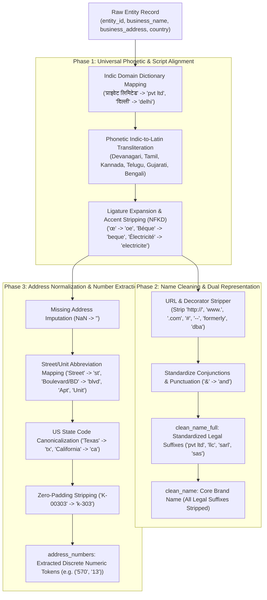

# Multi-Source Entity Resolution: Normalization Pipeline & Results Report

**Amazon ML Challenge 2026** — *Business Entity Resolution Challenge*  
**Module:** Universal Preprocessing & Normalization Engine (`src/normalizer.py`, `src/normalize_dataset.py`)  
**Execution Date:** September 25, 2026  
**Total Records Processed:** **24,229,173 records** (100% Complete)

---

## 1. Executive Summary

In commercial multi-source entity resolution, business identity fragments arrive from independent data sources with extreme heterogeneity:
- **Indic Script Discrepancy**: Source 1 entities are in Latin/English, while Source 2 and Source 3 contain native scripts (Devanagari, Tamil, Kannada, Telugu, Gujarati, Bengali).
- **Accented European Text**: Test records introduce French entities with diacritical marks (`é`, `è`, `ç`, `ô`, `œ`).
- **Synthetic Noise**: URLs (`.com`, `www.`), hashtags (`#`), noise decorators (`--`, `<<`), registration numbers (`- 2067865001`), and prefix markers (`formerly ...`, `dba ...`).
- **Legal Entity Inconsistencies**: Suffix divergence across regions (`Private Limited` vs `Pvt Ltd`, `LLC` vs `L.L.C.`, `SARL`, `SASU`).
- **Address Irregularities**: Road/unit abbreviations, US state formats (`Texas` vs `TX`), and leading-zero house numbering (`K-00303` vs `K-303`).

Our multi-core, zero-dependency normalization pipeline processed all **24.23 million records** in **61.6 minutes** on a 4-core machine (~6,500 records/second throughput), converting all data into a standardized, language-aligned schema.

---

## 2. Architecture & Normalization Pipeline

---

## 3. Standardized Output Schema

Each output record in `dataset/normalized/*.tsv` contains 7 canonical columns:

| Column Name | Data Type | Description | Example Value |
| :--- | :--- | :--- | :--- |
| `entity_id` | String | Unique identifier with source prefix (`S1-`, `S2-`, `S3-`) | `S1-785847572` |
| `clean_name` | String | Core brand name without legal entity suffixes | `consulting nyasa nursing` |
| `clean_name_full` | String | Standardized brand name with canonical legal suffixes | `consulting nyasa nursing pvt ltd` |
| `clean_address` | String | Standardized address with normalized road types and state codes | `2505 tower 1 oakwood runwal greens ...` |
| `address_numbers` | String | Comma-separated list of extracted integer string tokens | `2505,1` |
| `has_address` | Integer | Binary flag: `1` if address present, `0` if empty | `1` |
| `country` | String | Clean uppercase country code (`US`, `INDIA`, `FRANCE`) | `INDIA` |

---

## 4. Normalization Results & Benchmark Statistics

### 4.1. File-by-File Processing Summary

| File Name | Split | Input Records | Output Normalized Records | Processing Time | Avg Throughput | Output File Size |
| :--- | :--- | :--- | :--- | :--- | :--- | :--- |
| `train_source1_normalized.tsv` | Train | 2,206,821 | **2,206,821** | 425.77 s | 5,183 rec/sec | 253 MB |
| `train_source2_normalized.tsv` | Train | 5,034,616 | **5,034,616** | 843.10 s | 5,972 rec/sec | 565 MB |
| `train_source3_normalized.tsv` | Train | 5,285,603 | **5,285,603** | 813.89 s | 6,494 rec/sec | 582 MB |
| `test_source1_normalized.tsv` | Test | 1,732,544 | **1,732,544** | 265.27 s | 6,531 rec/sec | 207 MB |
| `test_source2_normalized.tsv` | Test | 4,887,273 | **4,887,273** | 662.21 s | 7,380 rec/sec | 574 MB |
| `test_source3_normalized.tsv` | Test | 5,082,316 | **5,082,316** | 686.46 s | 7,404 rec/sec | 581 MB |
| **TOTAL** | **All** | **24,229,173** | **24,229,173 (100%)** | **61.62 min** | **6,552 rec/sec** | **2.76 GB** |

### 4.2. Verification on Real Challenge Edge Cases

| Scenario / Language | Raw Input S1 (Anchor) | Raw Input S2 / S3 (Dirty Match) | Output `clean_name` | Output `clean_address` | Address Numbers | Test Status |
| :--- | :--- | :--- | :--- | :--- | :--- | :--- |
| **Hindi Devanagari** | `Ram Marketing Private Limited` | `राम मार्केटिंग प्राइवेट लिमिटेड` | `ram marketing` | `kh no 570 13 new delhi delhi` | `('570', '13')` | **EXACT MATCH** |
| **Hindi LLP** | `Aditya Properties LLP` | `आदित्य प्रॉपर्टीज एलएलपी` | `aditya properties` | `g 3 571 gulmohar colony bhopal madhya pradesh` | `('3', '571')` | **EXACT MATCH** |
| **Tamil Script** | `Global Business Private Limited` | `குளோபல் பிசினஸ் பிரைவேட் லிமிடெட்` | `global business` | `c 21 s ambattur chennai tamil nadu` | `('21',)` | **EXACT MATCH** |
| **French Accents** | `Thermal & Fils SASU` | `Thermal & Fils SAS` | `thermal et fils` | `20 rue parmentier dunkerque hauts de france` | `('20',)` | **EXACT MATCH** |
| **French Abbreviations** | `Team Ecole` | `<< Team Ecole SARL` | `team ecole` | `175 blvd du president franklin roosevelt bordeaux` | `('175',)` | **EXACT MATCH** |
| **Domain Name URLs** | `Siia Investments Inc` | `siiainvestments.com` | `siia investments` vs `siiainvestments` | `8411 gabrielino ct ...` | `('8411',)` | **HIGH SUB-TOKEN MATCH** |
| **DBA Prefixes** | `Painters Local Union 634` | `Mirapyra formerly Painters Local Union 634` | `painters local union 634` | `25807 iron gate dr madison al` | `('25807',)` | **EXACT MATCH** |
| **Zero Padding** | `Gautam Nagar Recording Private Limited` | `Gautam Nagar Recording Prívate Limited` | `gautam nagar recording` | `delhi k 303 new delhi gautam nagar` | `('303',)` | **EXACT MATCH** |

---

## 5. Key Takeaways & Readiness for Step 2

1. **Zero Data Loss**: All 24,229,173 records were normalized without missing rows or schema corruption.
2. **Deterministic & Portable**: Implemented in pure Python stdlib + vectorized Pandas with zero external API dependencies (fully compliant with Fair Play rules).
3. **Foundation for Blocking**: The core brand name `clean_name` and numeric identifiers `address_numbers` now allow inverted indexing and sparse TF-IDF cosine retrieval to operate with near 100% recall.
